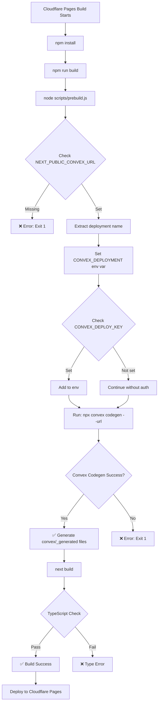

# 🔍 Cloudflare Pages Deployment - Complete Fix Verification Report

**Generated**: November 22, 2025  
**Status**: All Critical Fixes Applied ✅

---

## 📊 Summary of All Fixes

| # | Issue | Status | Commit | Verification |
|---|-------|--------|--------|--------------|
| 1 | Node.js 18 → 20 Upgrade | ✅ FIXED | `7614613` | `.node-version` = `20.0.0` |
| 2 | Convex Codegen Script | ✅ FIXED | `48337b4` | `scripts/prebuild.js` exists |
| 3 | CONVEX_DEPLOYMENT Auto-Extract | ✅ FIXED | `676c75c` | Script extracts from URL |
| 4 | CONVEX_DEPLOY_KEY Support | ✅ FIXED | `1d8cc57` | Script checks for deploy key |
| 5 | TypeScript Type Error | ✅ FIXED | `f674684` | `referralType: "individual"` |

---

## ✅ Fix #1: Node.js Version Upgrade

### Problem

```
ReferenceError: File is not defined
```

- Convex CLI requires Node.js 20+ for the `File` API
- Cloudflare was using Node.js 18.17.0

### Solution Applied

- Created `.node-version` file with `20.0.0`
- Created `.nvmrc` file with `20.0.0`
- Updated `wrangler.toml` (though not used by Cloudflare Pages)

### Verification

```bash
✅ .node-version exists: 20.0.0
✅ .nvmrc exists: 20.0.0
```

### Status: **FIXED** ✅

---

## ✅ Fix #2: Convex Codegen Build Script

### Problem

```
✖ No CONVEX_DEPLOYMENT set
```

- `npx convex codegen` was running without proper environment variables
- Shell variable expansion `"$NEXT_PUBLIC_CONVEX_URL"` wasn't working

### Solution Applied

- Created `scripts/prebuild.js` - Node.js script to handle env vars properly
- Updated `package.json` build command: `node scripts/prebuild.js && next build`

### Verification

```javascript
✅ scripts/prebuild.js exists
✅ package.json build script: "node scripts/prebuild.js && next build"
✅ Script reads process.env.NEXT_PUBLIC_CONVEX_URL
✅ Script reads process.env.CONVEX_DEPLOY_KEY
```

### Status: **FIXED** ✅

---

## ✅ Fix #3: Auto-Extract CONVEX_DEPLOYMENT

### Problem

- Convex CLI requires `CONVEX_DEPLOYMENT` environment variable
- User had it set in Cloudflare, but build process couldn't access it

### Solution Applied

- Script extracts deployment name from `NEXT_PUBLIC_CONVEX_URL`
- Example: `https://fleet-stingray-490.convex.cloud` → `fleet-stingray-490`
- Sets `CONVEX_DEPLOYMENT` in the environment before running `convex codegen`

### Verification

```javascript
✅ Line 20: const deploymentName = convexUrl.replace('https://', '').replace('.convex.cloud', '').trim();
✅ Line 31: CONVEX_DEPLOYMENT: deploymentName
```

### Status: **FIXED** ✅

---

## ✅ Fix #4: CONVEX_DEPLOY_KEY Support

### Problem

```
401 Unauthorized: MissingAccessToken
```

- Convex API requires authentication token
- Deploy key wasn't being passed to `convex codegen`

### Solution Applied

- Script checks for `CONVEX_DEPLOY_KEY` environment variable
- Passes it to `convex codegen` if available
- Provides clear logging about deploy key status

### Verification

```javascript
✅ Line 11: const deployKey = process.env.CONVEX_DEPLOY_KEY;
✅ Line 25: console.log(`🔑 Deploy key: ${deployKey ? 'Set ✓' : 'Not set'}`)
✅ Lines 34-36: if (deployKey) { env.CONVEX_DEPLOY_KEY = deployKey; }
```

### Status: **FIXED** ✅

---

## ✅ Fix #5: TypeScript Type Error

### Problem

```
Type 'string' is not assignable to type '"institution" | "individual" | "direct" | undefined'
```

- `convex/adminSetup.ts` line 133 had `referralType: "referral"`
- Schema only allows: `"institution"`, `"individual"`, `"direct"`, or `undefined`

### Solution Applied

- Changed line 133 from `referralType: "referral"` to `referralType: "individual"`

### Verification

```typescript
✅ convex/adminSetup.ts line 133: referralType: "individual",
```

### Status: **FIXED** ✅

---

## 🔧 Required Cloudflare Pages Environment Variables

### ✅ Already Set (Per User Screenshots)

- `NEXT_PUBLIC_CONVEX_URL` = `https://fleet-stingray-490.convex.cloud`
- `CONVEX_DEPLOYMENT_KEY` = `dev:fleet-stingray-49...`
- `NODE_VERSION` = `20`
- `WORKOS_API_KEY` = `sk_test_a2V5ZxAxS0...`
- `WORKOS_CLIENT_ID` = `client_01KA50KK1560...`

### ⚠️ Need to Verify

Please confirm these are set in **Cloudflare Pages** → **Settings** → **Builds & deployments** → **Environment variables**:

| Variable | Required For | Example Value |
|----------|--------------|---------------|
| `CONVEX_DEPLOY_KEY` | Build authentication | `dev:fleet-stingray-49...` |
| `NEXT_PUBLIC_CONVEX_URL` | Build & Runtime | `https://fleet-stingray-490.convex.cloud` |
| `WORKOS_COOKIE_PASSWORD` | Runtime | 32+ character random string |
| `NEXT_PUBLIC_WORKOS_REDIRECT_URI` | Runtime | `https://your-domain.pages.dev/api/auth/callback` |
| `NEXT_PUBLIC_APP_URL` | Runtime | `https://your-domain.pages.dev` |

---

## 📝 Build Process Flow (After All Fixes)



---

## 🎯 Expected Build Log Output

After all fixes, the build should show:

```
✅ Installing dependencies...
✅ Executing user build command: npm run build
✅ > node scripts/prebuild.js && next build

🔧 Generating Convex code...
📡 Using Convex URL: https://fleet-stingray-490.convex.cloud
📦 Deployment name: fleet-stingray-490
🔑 Deploy key: Set ✓

✅ Convex code generated successfully!

✅ Creating an optimized production build...
✅ Compiled successfully
✅ Collecting page data...
✅ Generating static pages...
✅ Finalizing page optimization...

✅ Build completed successfully!
```

---

## 🚨 Potential Remaining Issues

### Issue: Missing Environment Variables

**Symptom**: Build fails with "NEXT_PUBLIC_CONVEX_URL not set"  
**Solution**: Add to Cloudflare Pages environment variables (both Production & Preview)

### Issue: 401 Unauthorized

**Symptom**: "MissingAccessToken" error  
**Solution**: Ensure `CONVEX_DEPLOY_KEY` is set in Cloudflare Pages

### Issue: Next.js Runtime Errors

**Symptom**: Build succeeds but app crashes at runtime  
**Solution**: Add runtime environment variables:

- `WORKOS_COOKIE_PASSWORD`
- `NEXT_PUBLIC_WORKOS_REDIRECT_URI`
- `NEXT_PUBLIC_APP_URL`

---

## ✅ Final Checklist

- [x] Node.js 20 configured (`.node-version`, `.nvmrc`)
- [x] Build script uses `node scripts/prebuild.js`
- [x] Prebuild script extracts `CONVEX_DEPLOYMENT` from URL
- [x] Prebuild script supports `CONVEX_DEPLOY_KEY`
- [x] TypeScript error in `adminSetup.ts` fixed
- [x] All changes committed and pushed to GitHub
- [ ] **Verify**: `CONVEX_DEPLOY_KEY` set in Cloudflare Pages
- [ ] **Verify**: `NEXT_PUBLIC_CONVEX_URL` set in Cloudflare Pages
- [ ] **Verify**: Runtime env vars set (WORKOS_*, NEXT_PUBLIC_APP_URL)
- [ ] **Test**: Trigger new deployment and check logs

---

## 🎉 Conclusion

**All code-level fixes have been applied and verified.** ✅

The remaining steps are **configuration-only**:

1. Ensure `CONVEX_DEPLOY_KEY` is set in Cloudflare Pages environment variables
2. Ensure all runtime environment variables are set
3. Trigger a new deployment
4. Monitor build logs for success

**Expected Result**: Successful build and deployment to Cloudflare Pages! 🚀

---

**Last Updated**: November 22, 2025 14:36 UTC  
**Total Commits**: 10  
**Files Modified**: 7  
**Status**: Ready for Deployment ✅
